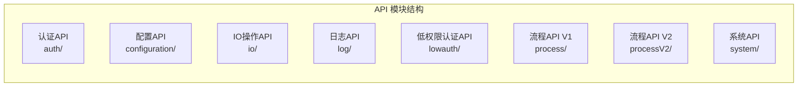

# Basic 包 API 参考

## API 模块总览

Basic 包提供了完整的 API 接口体系，涵盖认证、配置、IO操作、日志、流程和系统等功能。



## 认证模块 (auth/)

### 基本认证功能

#### `login(credentials)`
用户登录认证

```typescript
interface LoginCredentials {
  username: string;
  password: string;
  captcha?: string;
  remember?: boolean;
}

interface LoginResponse {
  success: boolean;
  data?: {
    token: string;
    refreshToken: string;
    userInfo: UserInfo;
    expiresIn: number;
  };
  message?: string;
}

async function login(credentials: LoginCredentials): Promise<LoginResponse>
```

**参数：**
- `credentials.username` - 用户名
- `credentials.password` - 密码
- `credentials.captcha` - 验证码（可选）
- `credentials.remember` - 是否记住登录状态（可选）

**返回值：**
- `success` - 登录是否成功
- `data` - 登录成功后的用户信息和令牌
- `message` - 登录失败时的错误信息

#### `logout()`
用户登出

```typescript
async function logout(): Promise<{ success: boolean; message?: string }>
```

#### `getCurrentUser()`
获取当前用户信息

```typescript
interface UserInfo {
  id: string;
  username: string;
  email: string;
  roles: string[];
  permissions: string[];
  profile: UserProfile;
}

async function getCurrentUser(): Promise<UserInfo | null>
```

#### `refreshToken()`
刷新访问令牌

```typescript
async function refreshToken(): Promise<{ success: boolean; token?: string }>
```

### 权限验证

#### `hasPermission(permission)`
检查用户是否具有指定权限

```typescript
function hasPermission(permission: string): boolean
```

#### `hasRole(role)`
检查用户是否具有指定角色

```typescript
function hasRole(role: string): boolean
```

## 配置模块 (configuration/)

### 配置获取

#### `getConfig(key)`
获取指定配置项

```typescript
async function getConfig(key: string): Promise<any>
```

**参数：**
- `key` - 配置项键名，支持嵌套路径如 `'app.theme.color'`

#### `getAllConfig()`
获取所有配置

```typescript
async function getAllConfig(): Promise<Record<string, any>>
```

#### `getConfigSchema()`
获取配置项的 JSON Schema

```typescript
interface ConfigSchema {
  type: string;
  properties: Record<string, any>;
  required: string[];
}

async function getConfigSchema(): Promise<ConfigSchema>
```

### 配置管理

#### `setConfig(key, value)`
设置配置项

```typescript
async function setConfig(key: string, value: any): Promise<{ success: boolean }>
```

#### `updateConfig(updates)`
批量更新配置

```typescript
interface ConfigUpdates {
  [key: string]: any;
}

async function updateConfig(updates: ConfigUpdates): Promise<{ success: boolean }>
```

#### `resetConfig(key)`
重置配置项为默认值

```typescript
async function resetConfig(key: string): Promise<{ success: boolean }>
```

## IO 模块 (io/)

### 文件操作

#### `uploadFile(file, options)`
文件上传

```typescript
interface UploadOptions {
  path?: string;
  maxSize?: number;
  allowedTypes?: string[];
  metadata?: Record<string, any>;
}

interface UploadResult {
  success: boolean;
  fileId: string;
  url: string;
  size: number;
  name: string;
  message?: string;
}

async function uploadFile(
  file: File | Blob, 
  options?: UploadOptions
): Promise<UploadResult>
```

#### `downloadFile(fileId, options)`
文件下载

```typescript
interface DownloadOptions {
  filename?: string;
  thumbnail?: boolean;
  preview?: boolean;
}

async function downloadFile(
  fileId: string, 
  options?: DownloadOptions
): Promise<Blob>
```

#### `deleteFile(fileId)`
删除文件

```typescript
async function deleteFile(fileId: string): Promise<{ success: boolean }>
```

#### `getFileInfo(fileId)`
获取文件信息

```typescript
interface FileInfo {
  id: string;
  name: string;
  size: number;
  type: string;
  url: string;
  createdAt: string;
  updatedAt: string;
}

async function getFileInfo(fileId: string): Promise<FileInfo | null>
```

### 数据导入导出

#### `exportData(data, format, options)`
数据导出

```typescript
type ExportFormat = 'json' | 'csv' | 'excel' | 'pdf';

interface ExportOptions {
  filename?: string;
  headers?: string[];
  template?: string;
}

async function exportData(
  data: any[], 
  format: ExportFormat, 
  options?: ExportOptions
): Promise<Blob>
```

#### `importData(file, format, options)`
数据导入

```typescript
interface ImportOptions {
  mapping?: Record<string, string>;
  validation?: boolean;
  skipDuplicates?: boolean;
}

interface ImportResult {
  success: boolean;
  imported: number;
  errors: any[];
  data: any[];
}

async function importData(
  file: File, 
  format: ExportFormat, 
  options?: ImportOptions
): Promise<ImportResult>
```

## 日志模块 (log/)

### 日志记录

#### `info(message, context)`
记录信息日志

```typescript
interface LogContext {
  userId?: string;
  sessionId?: string;
  action?: string;
  [key: string]: any;
}

async function info(
  message: string, 
  context?: LogContext
): Promise<{ success: boolean }>
```

#### `error(message, error, context)`
记录错误日志

```typescript
async function error(
  message: string, 
  error?: Error, 
  context?: LogContext
): Promise<{ success: boolean }>
```

#### `warn(message, context)`
记录警告日志

```typescript
async function warn(
  message: string, 
  context?: LogContext
): Promise<{ success: boolean }>
```

#### `debug(message, context)`
记录调试日志

```typescript
async function debug(
  message: string, 
  context?: LogContext
): Promise<{ success: boolean }>
```

### 日志查询

#### `getLogs(filters)`
查询日志记录

```typescript
interface LogFilters {
  level?: 'info' | 'error' | 'warn' | 'debug';
  startTime?: string;
  endTime?: string;
  userId?: string;
  action?: string;
  limit?: number;
  offset?: number;
}

interface LogEntry {
  id: string;
  level: string;
  message: string;
  context: LogContext;
  timestamp: string;
}

async function getLogs(filters: LogFilters): Promise<LogEntry[]>
```

## 流程模块 (process/ & processV2/)

### V1 流程 API

#### `startProcess(processId, variables)`
启动流程

```typescript
interface ProcessVariables {
  [key: string]: any;
}

interface ProcessInstance {
  id: string;
  processId: string;
  status: string;
  variables: ProcessVariables;
  startedAt: string;
}

async function startProcess(
  processId: string, 
  variables?: ProcessVariables
): Promise<ProcessInstance>
```

#### `completeTask(taskId, variables)`
完成任务

```typescript
interface Task {
  id: string;
  name: string;
  assignee?: string;
  status: string;
  variables: ProcessVariables;
  createdAt: string;
}

async function completeTask(
  taskId: string, 
  variables?: ProcessVariables
): Promise<Task>
```

#### `getTasks(assignee)`
获取任务列表

```typescript
async function getTasks(assignee?: string): Promise<Task[]>
```

### V2 流程 API

#### `createProcessDefinition(definition)`
创建流程定义

```typescript
interface ProcessDefinition {
  id: string;
  name: string;
  description?: string;
  version: string;
  bpmnXml: string;
  metadata?: Record<string, any>;
}

async function createProcessDefinition(
  definition: ProcessDefinition
): Promise<{ success: boolean; id: string }>
```

#### `deployProcess(definitionId)`
部署流程

```typescript
async function deployProcess(
  definitionId: string
): Promise<{ success: boolean; deploymentId: string }>
```

#### `getProcessInstances(filters)`
获取流程实例

```typescript
interface ProcessInstanceFilters {
  definitionId?: string;
  status?: string;
  startTime?: string;
  endTime?: string;
  limit?: number;
  offset?: number;
}

async function getProcessInstances(
  filters: ProcessInstanceFilters
): Promise<ProcessInstance[]>
```

## 系统模块 (system/)

### 系统信息

#### `getSystemInfo()`
获取系统信息

```typescript
interface SystemInfo {
  version: string;
  environment: string;
  nodeVersion: string;
  platform: string;
  architecture: string;
  uptime: number;
  memory: {
    total: number;
    used: number;
    free: number;
  };
}

async function getSystemInfo(): Promise<SystemInfo>
```

#### `getSystemConfig()`
获取系统配置

```typescript
interface SystemConfig {
  app: {
    name: string;
    version: string;
    description: string;
  };
  database: {
    type: string;
    host: string;
    port: number;
  };
  features: {
    [key: string]: boolean;
  };
}

async function getSystemConfig(): Promise<SystemConfig>
```

### 健康检查

#### `healthCheck()`
系统健康检查

```typescript
interface HealthStatus {
  status: 'healthy' | 'unhealthy' | 'degraded';
  checks: {
    database: boolean;
    cache: boolean;
    externalServices: boolean;
  };
  timestamp: string;
}

async function healthCheck(): Promise<HealthStatus>
```

#### `getMetrics()`
获取系统指标

```typescript
interface SystemMetrics {
  requests: {
    total: number;
    success: number;
    error: number;
    averageResponseTime: number;
  };
  resources: {
    cpu: number;
    memory: number;
    disk: number;
  };
  activeUsers: number;
  activeSessions: number;
}

async function getMetrics(): Promise<SystemMetrics>
```

## 低权限认证模块 (lowauth/)

### 公开接口

#### `publicLogin(credentials)`
公开接口登录（有限权限）

```typescript
interface PublicCredentials {
  username: string;
  password: string;
  clientSecret?: string;
}

async function publicLogin(
  credentials: PublicCredentials
): Promise<{ success: boolean; token?: string; permissions: string[] }>
```

#### `validateToken(token)`
验证令牌有效性

```typescript
async function validateToken(
  token: string
): Promise<{ valid: boolean; payload?: any }>
```

## 工具函数 API

### Cookie 工具

```typescript
interface CookieOptions {
  expires?: number | Date;
  path?: string;
  domain?: string;
  secure?: boolean;
  httpOnly?: boolean;
  sameSite?: 'Strict' | 'Lax' | 'None';
}

class CookieUtil {
  set(name: string, value: string, options?: CookieOptions): void;
  get(name: string): string | null;
  remove(name: string, options?: Partial<CookieOptions>): void;
  has(name: string): boolean;
  getAll(): Record<string, string>;
  clear(): void;
}
```

### 本地存储工具

```typescript
interface StorageOptions {
  expires?: number;
  prefix?: string;
}

class StorageUtil {
  setItem(key: string, value: any, options?: StorageOptions): void;
  getItem(key: string): any;
  removeItem(key: string): void;
  clear(): void;
  getAll(): Record<string, any>;
  setItemWithExpiry(key: string, value: any, ttl: number): void;
  getItemWithExpiry(key: string): any;
  clearExpired(): void;
}
```

### 路由工具

```typescript
class RouteUtil {
  buildUrl(path: string, params?: Record<string, any>): string;
  parseUrlParams(url: string): Record<string, string>;
  addQueryParam(url: string, key: string, value: any): string;
  removeQueryParam(url: string, key: string): string;
  encodePath(template: string, params: Record<string, any>): string;
}
```

### URL 编码工具

```typescript
class EncodeUtil {
  encode(url: string, params?: Record<string, any>): string;
  decode(encodedUrl: string): { url: string; params: Record<string, any> };
  encodePath(path: string, params?: Record<string, any>): string;
  decodePath(encodedPath: string): { path: string; params: Record<string, any> };
}
```

## 错误类型

### 通用错误

```typescript
interface APIError {
  code: string;
  message: string;
  details?: any;
  timestamp: string;
}

// 常见错误代码
enum ErrorCodes {
  UNAUTHORIZED = 'UNAUTHORIZED',
  FORBIDDEN = 'FORBIDDEN',
  NOT_FOUND = 'NOT_FOUND',
  VALIDATION_ERROR = 'VALIDATION_ERROR',
  INTERNAL_ERROR = 'INTERNAL_ERROR',
  NETWORK_ERROR = 'NETWORK_ERROR',
  TIMEOUT_ERROR = 'TIMEOUT_ERROR'
}
```

### 模块特定错误

```typescript
// 认证错误
interface AuthError extends APIError {
  type: 'AUTH_ERROR';
  loginAttempts?: number;
  lockoutTime?: number;
}

// 文件操作错误
interface FileError extends APIError {
  type: 'FILE_ERROR';
  fileName?: string;
  fileSize?: number;
  fileType?: string;
}

// 流程错误
interface ProcessError extends APIError {
  type: 'PROCESS_ERROR';
  processId?: string;
  taskId?: string;
  stepId?: string;
}
```

---

**API 参考**为 AI 代理提供完整的接口文档，包括所有可用的 API 方法、参数说明和返回值类型。