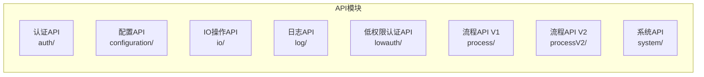
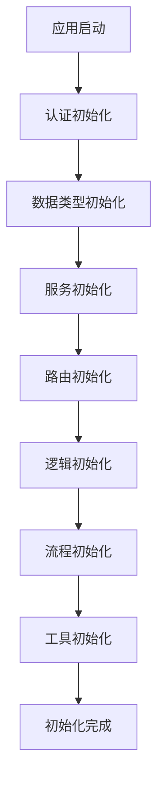
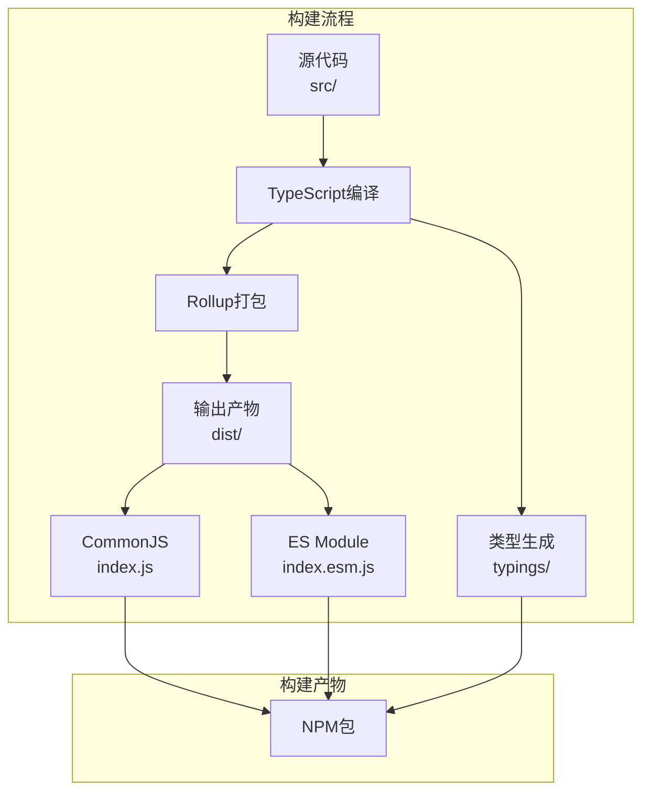

# LCAP Basic Template 技术说明文档

## 项目概述

`@lcap/basic-template` 是一个低代码应用平台（LCAP）的基础模板库，提供了完整的前端应用开发基础设施，包括 API 管理、路由系统、数据类型处理、工具函数等核心功能模块。

### 基本信息

- **包名**: `@lcap/basic-template`
- **主入口**: `dist/index.js`
- **ESM入口**: `dist/index.esm.js`
- **类型定义**: `typings/index.d.ts`

## 架构设计

### 系统架构图

```mermaid
graph TB
    subgraph "LCAP Basic Template"
        CORE[核心模块]
        CONFIG[配置系统]
        GLOBAL[全局状态]
    end
    
    subgraph "功能模块"
        API[API管理]
        INIT[初始化模块]
        ROUTER[路由系统]
        SDK[SDK工具集]
        UTILS[工具函数]
    end
    
    subgraph "子模块详情"
        subgraph "API模块"
            AUTH[认证API]
            CONFIG_API[配置API]
            IO[IO操作API]
            LOG[日志API]
            PROCESS[流程API]
            SYSTEM[系统API]
        end
        
        subgraph "初始化模块"
            INIT_AUTH[认证初始化]
            INIT_DATA[数据类型初始化]
            INIT_LOGIC[逻辑初始化]
            INIT_PROCESS[流程初始化]
            INIT_ROUTER[路由初始化]
            INIT_SERVICE[服务初始化]
            INIT_UTILS[工具初始化]
        end
        
        subgraph "工具模块"
            COOKIE[Cookie工具]
            STORAGE[存储工具]
            REQUEST[请求工具]
            ROUTE[路由工具]
            ENCODE[编码工具]
        end
    end
    
    CORE --> CONFIG
    CORE --> GLOBAL
    CORE --> API
    CORE --> INIT
    CORE --> ROUTER
    CORE --> SDK
    CORE --> UTILS
    
    API --> AUTH
    API --> CONFIG_API
    API --> IO
    API --> LOG
    API --> PROCESS
    API --> SYSTEM
    
    INIT --> INIT_AUTH
    INIT --> INIT_DATA
    INIT --> INIT_LOGIC
    INIT --> INIT_PROCESS
    INIT --> INIT_ROUTER
    INIT --> INIT_SERVICE
    INIT --> INIT_UTILS
    
    UTILS --> COOKIE
    UTILS --> STORAGE
    UTILS --> REQUEST
    UTILS --> ROUTE
    UTILS --> ENCODE
```



### 核心目录结构

```
src/
├── config.ts          # 配置系统核心
├── global.ts          # 全局状态管理
├── index.ts           # 主入口文件
├── apis/              # API接口模块
│   ├── auth/          # 认证相关API
│   ├── configuration/ # 配置相关API
│   ├── io/           # IO操作API
│   ├── log/          # 日志API
│   ├── lowauth/      # 低权限认证API
│   ├── process/      # 流程API (V1)
│   ├── processV2/    # 流程API (V2)
│   └── system/       # 系统API
├── init/              # 初始化模块
│   ├── auth/         # 认证初始化
│   ├── dataTypes/    # 数据类型初始化
│   ├── logic/        # 逻辑初始化
│   ├── process/      # 流程初始化
│   ├── router/       # 路由初始化
│   ├── service/      # 服务初始化
│   └── utils/        # 工具初始化
├── router/            # 路由系统
│   └── guards/       # 路由守卫
├── sdk/               # SDK工具集
│   ├── Formatters/   # 格式化器
│   ├── modules/      # 模块集合
│   └── types/        # 类型定义
├── types/            # 全局类型定义
└── utils/            # 工具函数
    ├── cookie.ts     # Cookie操作
    ├── localStorage.ts # 本地存储
    ├── route.ts      # 路由工具
    ├── encodeUrl.ts  # URL编码
    ├── create/       # 创建工具
    ├── json-bigint/  # 大数字JSON处理
    └── request-pre/  # 请求预处理
```

## 核心模块详解

### 配置系统 (config.ts)

配置系统是整个模板的核心，定义了应用的基础配置结构：

```typescript
type ConfigType = {
  toast: {
    show: (message: string, stack?: string) => void;
    error: (message: string, stack?: string) => void;
  };
  utils: any;
  router: {
    destination?: (url: string, target: string) => void;
    back?: () => void;
    go?: (delta?: number) => void;
  };
  axios: {
    interceptors: Array<any>;
  };
  configureRequest?: (options: any, axios: any) => void;
  reactive?: (obj: any) => void;
  globalProperties: {
    set: (key: string, value: any) => void;
    get: (key: string) => any;
  };
};
```

**主要功能：**
- **消息提示配置**: 统一的消息提示接口
- **路由配置**: 路由跳转、回退等操作
- **HTTP配置**: Axios拦截器和请求配置
- **响应式配置**: 响应式数据处理
- **全局属性**: 全局属性的设置和获取

### 全局状态管理 (global.ts)

提供全局状态管理功能，兼容 Vue 生态系统：

```typescript
// 用来mock Vue的构造函数
const GlobalFn = window.Vue || function MockVue() {};
export default GlobalFn;
export const global = new GlobalFn();
```

**特点：**
- 兼容 Vue 环境和非 Vue 环境
- 提供全局状态容器
- 支持 Mock 模式

### API 管理模块

#### API 模块结构


**各模块职责：**

1. **认证模块 (auth/)**
   - 用户登录/登出
   - Token 管理
   - 权限验证

2. **配置模块 (configuration/)**
   - 系统配置获取
   - 配置项管理

3. **IO模块 (io/)**
   - 文件上传下载
   - 数据导入导出

4. **日志模块 (log/)**
   - 操作日志记录
   - 错误日志收集

5. **流程模块 (process/ & processV2/)**
   - 工作流管理
   - 流程执行控制
   - V2 版本提供增强功能

6. **系统模块 (system/)**
   - 系统信息获取
   - 系统配置管理

### 初始化系统

初始化系统负责应用启动时的各种初始化操作：



### 工具函数库

提供丰富的工具函数支持日常开发：

#### 核心工具

1. **Cookie 工具 (cookie.ts)**
   ```typescript
   // Cookie 的读取、设置、删除等操作
   ```

2. **本地存储工具 (localStorage.ts)**
   ```typescript
   // localStorage 和 sessionStorage 的封装
   ```

3. **路由工具 (route.ts)**
   ```typescript
   // 路由操作相关工具函数
   ```

4. **URL 编码工具 (encodeUrl.ts)**
   ```typescript
   // URL 编码解码工具
   ```

#### 高级工具

1. **请求预处理工具 (request-pre/)**
   - 基于中间件架构的 HTTP 请求库
   - 支持请求/响应拦截
   - 内置 Mock 功能
   - 详见 [Request-Pre 技术文档](./src/utils/request-pre/README.md)

2. **大数字处理工具 (json-bigint/)**
   - 解决 JavaScript 大数字精度问题
   - JSON 序列化/反序列化支持

3. **创建工具集 (create/)**
   - 各种对象创建工具
   - 工厂模式实现

## 技术栈和依赖

### 核心依赖

| 依赖库 | 版本 | 用途 |
|--------|------|------|
| axios | 0.21.4 | HTTP 客户端 |
| lodash | 4.17.21 | 工具函数库 |
| moment | 2.30.1 | 日期时间处理 |
| date-fns | 2.30.0 | 现代日期库 |
| crypto-js | 4.2.0 | 加密解密 |
| qs | 6.11.2 | 查询字符串处理 |

### 数值计算库

| 依赖库 | 版本 | 用途 |
|--------|------|------|
| bignumber.js | 9.1.2 | 大数字运算 |
| decimal.js | 10.4.3 | 精确小数计算 |

### 开发和构建

| 依赖库 | 版本 | 用途 |
|--------|------|------|
| TypeScript | ^5.4.5 | 类型检查 |
| Rollup | ^4.18.0 | 打包构建 |
| Jest | ^29.7.0 | 单元测试 |
| TypeDoc | ^0.25.13 | 文档生成 |

## 构建系统

### 构建配置



### 构建命令

| 命令 | 功能 | 说明 |
|------|------|------|
| `npm run build` | 完整构建 | 执行 Rollup 打包和类型生成 |
| `npm run build:rollup` | 代码打包 | 使用 Rollup 打包 JS 代码 |
| `npm run build:types` | 类型生成 | 生成 TypeScript 类型定义 |
| `npm run test` | 运行测试 | 执行 Jest 单元测试 |
| `npm run doc` | 生成文档 | 使用 TypeDoc 生成 API 文档 |

### 输出格式

- **CommonJS**: `dist/index.js` - 兼容 Node.js 环境
- **ES Module**: `dist/index.esm.js` - 支持现代构建工具的 tree-shaking
- **类型定义**: `typings/` - 完整的 TypeScript 类型支持

## 测试系统

### 测试框架

使用 **Jest** 作为测试框架，支持：

- ✅ 单元测试
- ✅ 覆盖率报告
- ✅ TypeScript 支持
- ✅ Mock 功能

### 测试覆盖范围

```
tests/
├── bigNumber/          # 大数字处理测试
├── init/              # 初始化模块测试
├── service/           # 服务模块测试
└── utils/             # 工具函数测试
```

### 测试命令

```bash
# 运行所有测试
npm test

# 运行测试并生成覆盖率报告
npm run test -- --coverage
```

## 使用指南

### 基本使用

```typescript
// 导入整个库
import * as BasicTemplate from '@lcap/basic-template';

// 或按需导入
import { Config, setConfig, Global, global } from '@lcap/basic-template';

// 导入特定模块
import { authAPI } from '@lcap/basic-template';
import { initAuth } from '@lcap/basic-template';
```

### 配置应用

```typescript
import { setConfig } from '@lcap/basic-template';

// 设置应用配置
setConfig({
  toast: {
    show: (message) => console.log(message),
    error: (message) => console.error(message)
  },
  router: {
    destination: (url, target) => window.open(url, target),
    back: () => window.history.back(),
    go: (delta) => window.history.go(delta)
  },
  globalProperties: {
    set: (key, value) => window[key] = value,
    get: (key) => window[key]
  }
});
```

### 初始化应用

```typescript
import { 
  initAuth, 
  initDataTypes, 
  initService, 
  initRouter 
} from '@lcap/basic-template';

async function initApp() {
  // 按顺序初始化各模块
  await initAuth();
  await initDataTypes();
  await initService();
  await initRouter();
  
  console.log('应用初始化完成');
}
```

### 使用 API

```typescript
import { authAPI, systemAPI } from '@lcap/basic-template';

// 用户登录
const loginResult = await authAPI.login({
  username: 'admin',
  password: '123456'
});

// 获取系统信息
const systemInfo = await systemAPI.getSystemInfo();
```

### 使用工具函数

```typescript
import { cookie, localStorage, encodeUrl } from '@lcap/basic-template';

// Cookie 操作
cookie.set('token', 'abc123');
const token = cookie.get('token');

// 本地存储
localStorage.setItem('userInfo', { name: 'admin' });
const userInfo = localStorage.getItem('userInfo');

// URL 编码
const encodedUrl = encodeUrl('/api/user', { id: 123 });
```

## 最佳实践

### 1. 模块化导入

```typescript
// ✅ 推荐：按需导入
import { authAPI, Config } from '@lcap/basic-template';

// ❌ 不推荐：导入整个库
import * as BasicTemplate from '@lcap/basic-template';
```

### 2. 配置管理

```typescript
// ✅ 推荐：集中配置
const config = {
  toast: { /* ... */ },
  router: { /* ... */ },
  // 其他配置...
};
setConfig(config);

// ❌ 不推荐：分散配置
setConfig({ toast: { /* ... */ } });
setConfig({ router: { /* ... */ } });
```

### 3. 错误处理

```typescript
// ✅ 推荐：统一错误处理
try {
  const result = await authAPI.login(credentials);
  return result;
} catch (error) {
  Config.toast.error('登录失败', error.message);
  throw error;
}
```

### 4. 类型安全

```typescript
// ✅ 推荐：使用类型定义
import type { ConfigType } from '@lcap/basic-template';

const config: ConfigType = {
  // 类型安全的配置
};
```

## 贡献指南

### 开发环境设置

```bash
# 安装依赖
npm install

# 开发模式 (监听文件变化并自动发布到本地)
npm run dev

# 构建项目
npm run build

# 运行测试
npm test
```

### 代码规范

- 使用 TypeScript 开发
- 遵循 ESLint 规则
- 编写单元测试
- 更新相关文档

### 提交流程

1. Fork 项目
2. 创建功能分支 (`git checkout -b feature/amazing-feature`)
3. 提交更改 (`git commit -m 'Add some amazing feature'`)
4. 推送到分支 (`git push origin feature/amazing-feature`)
5. 创建 Pull Request

---

**LCAP Basic Template** 为低代码应用开发提供强大的基础设施支持，助力快速构建现代化 Web 应用。
