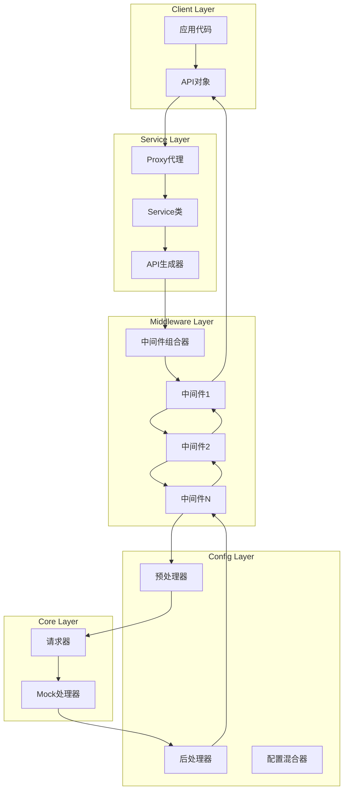
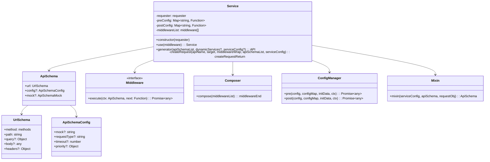
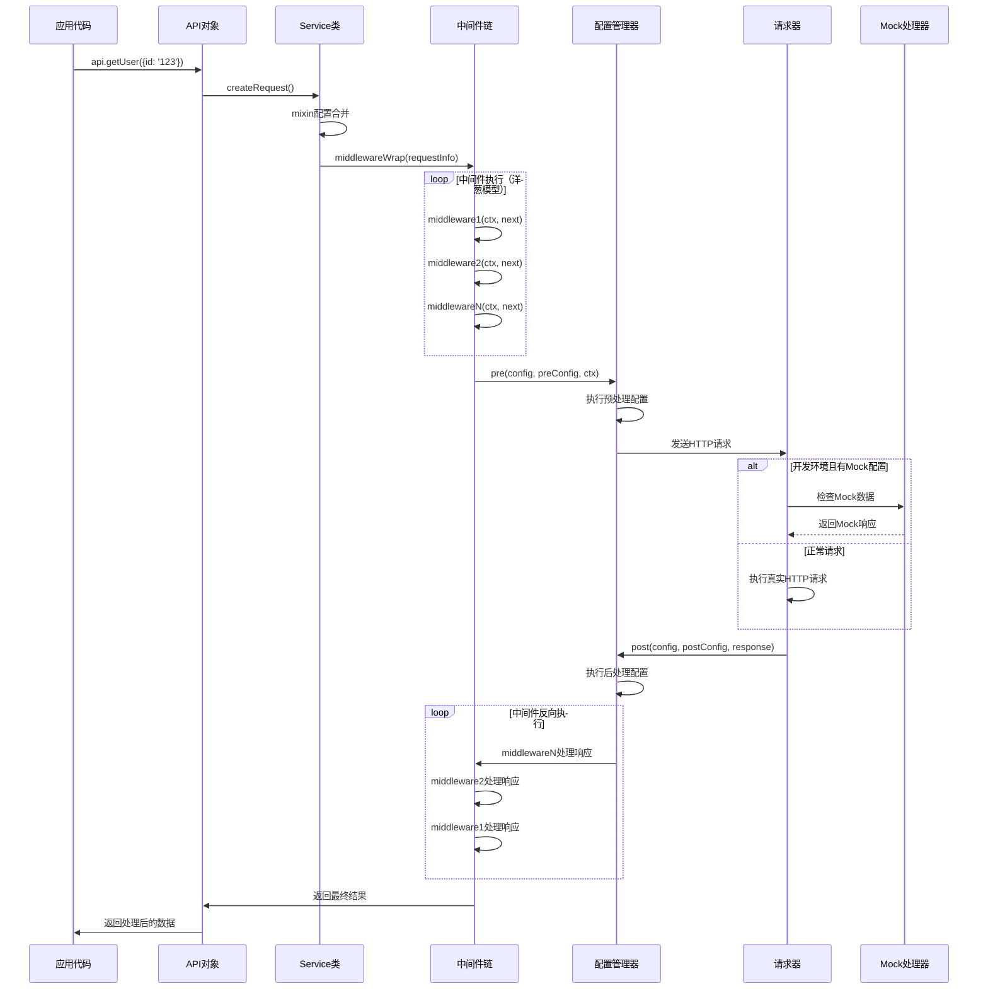
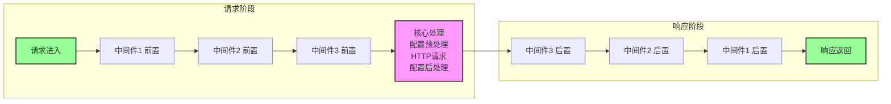
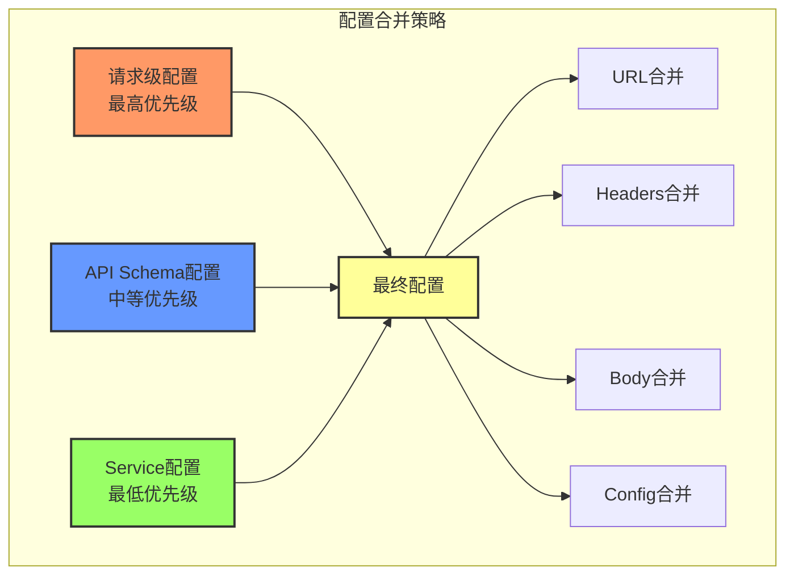
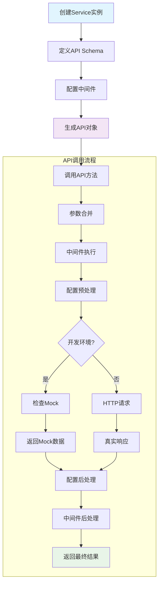
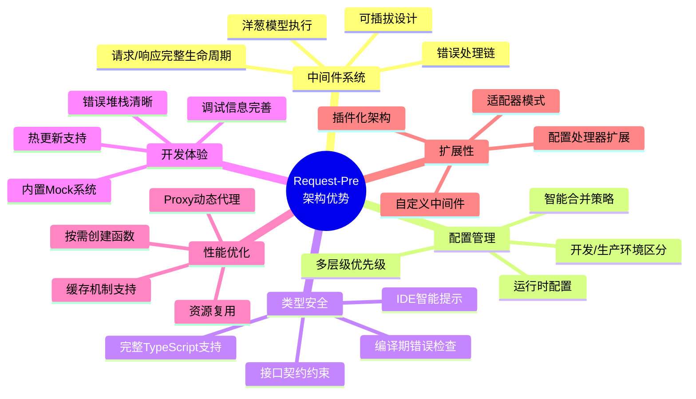

## Request-Pre 技术说明文档

### 概述

Request-Pre 是一个基于中间件架构的HTTP请求封装库，提供了完整的请求预处理、后处理、中间件插件系统和Mock功能。该库采用洋葱模型的中间件机制，支持请求/响应的链式处理和配置化管理。

### 架构设计

#### 系统架构图



#### 核心类图



#### 目录结构
```
request-pre/
├── index.ts           # 主服务类
├── api.ts            # 类型定义
├── config.ts         # 配置管理器
├── methods.ts        # HTTP方法枚举
├── config/           # 配置处理器
│   ├── preprocess.ts # 预处理配置
│   └── postprocess.ts# 后处理配置
├── middleware/       # 中间件
│   └── requestType.ts# 请求类型中间件
└── util/            # 工具函数
    ├── compose.ts   # 中间件组合器
    ├── mixin.ts     # 配置混合器
    ├── mock.ts      # Mock处理器
    ├── request.ts   # 请求类型定义
    └── utils.ts     # 通用工具函数
```

#### 请求执行时序图



#### 中间件洋葱模型图



#### 配置优先级示意图



#### 核心概念

##### 架构特点说明

**1. 分层架构设计**
- **客户端层**: 应用代码通过生成的API对象调用接口
- **服务层**: Service类负责API生成和请求创建
- **中间件层**: 可插拔的中间件系统，支持洋葱模型执行
- **配置层**: 预处理和后处理配置管理
- **核心层**: 底层HTTP请求执行和Mock处理

**2. 洋葱模型中间件**
- 请求从外层中间件开始，逐层向内执行
- 到达核心处理后，响应数据逐层向外返回
- 每个中间件都有机会处理请求和响应数据

**3. 多层配置合并**
- 请求级配置具有最高优先级
- API Schema配置为中等优先级
- Service配置为默认优先级
- 配置按优先级智能合并，避免冲突

##### 1. Service 服务类
主要的服务管理类，负责：
- 中间件管理
- API接口生成
- 配置管理
- 请求生命周期控制

##### 2. 中间件系统
基于洋葱模型的中间件架构：
```
请求 → 中间件1 → 中间件2 → 实际请求 → 中间件2 → 中间件1 → 响应
```

##### 3. 配置系统
支持三层配置优先级：
1. Service配置（全局配置）
2. API Schema配置（接口级配置）
3. Request配置（请求级配置）

### 核心模块详解

#### 1. Service 类 (`index.ts`)

Service 是整个系统的核心类，提供以下功能：

```typescript
class Service {
  // 构造函数，初始化请求器和配置
  constructor(requester: requester)
  
  // 添加中间件
  use(middleware: middleware): Service
  
  // 生成API接口对象
  generator<T extends ApiSchemaList>(
    apiSchemaList: T,
    dynamicServices?: any,
    serviceConfig?: ServiceConfig
  ): API<T>
}
```

**特点：**
- 支持 Proxy 动态代理（优先使用）和静态生成两种模式
- 内置预处理和后处理配置
- 支持中间件扩展
- 支持动态服务注入

#### 2. 配置管理器 (`config.ts`)

负责配置的优先级处理和执行：

```typescript
// 预处理：在请求发送前执行
async pre(config, configMap, initData, ctx): Promise<any>

// 后处理：在请求响应后执行  
async post(config, configMap, initData, ctx): Promise<any>
```

**配置执行顺序：**
- 按照 `priority` 字段排序
- 支持链式异步执行
- 支持错误处理分支

#### 3. 中间件组合器 (`util/compose.ts`)

实现洋葱模型的中间件执行机制：

```typescript
export default function compose(middlewareList: middleware[]): middlewareEnd
```

**执行流程：**
1. 从第一个中间件开始执行
2. 每个中间件可以调用 `next()` 继续执行下一个
3. 最后执行实际的请求处理
4. 响应数据沿着中间件链反向返回

#### 4. 配置混合器 (`util/mixin.ts`)

负责合并不同层级的配置：

```typescript
export default function mixin(
  serviceConfig: ServiceConfig,    // 服务级配置
  apiSchema: ApiSchema,           // API定义配置
  requestObj: ApiSchemaData       // 请求级配置
): ApiSchema
```

**合并策略：**
- URL路径参数替换
- Headers 深度合并
- Body 数据合并（支持对象和原始值）
- 配置优先级计算

#### 5. Mock 处理器 (`util/mock.ts`)

开发环境下的数据模拟功能：

```typescript
export default function addMock(requestInfo: ApiSchema): requestReturn | void
```

**Mock 配置：**
```typescript
mock: {
  "success": {
    success: true,
    data: { message: "成功" }
  },
  "error": {
    success: false, 
    data: { error: "失败" }
  }
}
```

#### 6. 请求类型中间件 (`middleware/requestType.ts`)

自动设置请求的 Content-Type：

```typescript
const map = {
  json: "application/json;charset=UTF-8",
  form: "application/x-www-form-urlencoded;charset=UTF-8"
}
```

### 使用示例

#### 架构使用流程图



#### 1. 基础使用

```typescript
import Service from './request-pre'
import axios from 'axios'

// 创建服务实例
const service = new Service(axios)

// 定义API Schema
const apiSchema = {
  getUser: {
    url: {
      method: 'GET',
      path: '/api/user/{id}',
      headers: { 'Authorization': 'Bearer token' }
    },
    config: {
      requestType: 'json',
      timeout: 5000
    }
  },
  createUser: {
    url: {
      method: 'POST', 
      path: '/api/user',
      body: {}
    },
    mock: {
      success: {
        success: true,
        data: { id: 1, name: 'test' }
      }
    }
  }
}

// 生成API对象
const api = service.generator(apiSchema, {}, {
  prefix: '/v1',
  headers: { 'X-API-Version': '1.0' }
})

// 调用API
const user = await api.getUser({ 
  path: { id: '123' },
  query: { include: 'profile' }
})

const newUser = await api.createUser({
  body: { name: 'John', email: 'john@example.com' },
  config: { mock: 'success' }
})
```

#### 2. 自定义中间件

```typescript
// 日志中间件
const loggerMiddleware = async (ctx, next) => {
  console.log('请求开始:', ctx.url.path)
  const start = Date.now()
  
  try {
    const result = await next()
    console.log('请求成功:', Date.now() - start + 'ms')
    return result
  } catch (error) {
    console.log('请求失败:', error.message)
    throw error
  }
}

// 重试中间件
const retryMiddleware = async (ctx, next) => {
  const maxRetries = ctx.config?.retries || 0
  let lastError
  
  for (let i = 0; i <= maxRetries; i++) {
    try {
      return await next()
    } catch (error) {
      lastError = error
      if (i < maxRetries) {
        await new Promise(resolve => setTimeout(resolve, 1000))
      }
    }
  }
  
  throw lastError
}

// 使用中间件
service.use(loggerMiddleware)
service.use(retryMiddleware)
```

#### 3. 预处理和后处理

```typescript
// 服务级配置
const serviceConfig = {
  prefix: '/api',
  config: {
    // 预处理函数
    preprocess: (ctx, prevData) => {
      // 添加时间戳
      if (ctx.url.body) {
        ctx.url.body.timestamp = Date.now()
      }
      return ctx
    },
    // 后处理函数
    postprocess: (data, ctx) => {
      // 统一响应格式处理
      if (data.code === 0) {
        return data.data
      } else {
        throw new Error(data.message)
      }
    },
    // 配置执行优先级
    priority: {
      preprocess: 10,   // 先执行预处理
      postprocess: 90   // 后执行后处理
    }
  }
}

const api = service.generator(apiSchema, {}, serviceConfig)
```

### 类型定义

#### API Schema 类型

```typescript
interface ApiSchema {
  url: {
    method: 'GET' | 'POST' | 'PUT' | 'DELETE' | 'PATCH' | 'HEAD' | 'OPTIONS'
    path: string
    query?: Record<string, any>
    body?: any
    headers?: Record<string, string>
  }
  config?: {
    mock?: string
    requestType?: 'json' | 'form'
    timeout?: number
    priority?: Record<string, number>
    [key: string]: any
  }
  mock?: Record<string, {
    success: boolean
    data: any
  }>
}
```

#### Service 配置类型

```typescript
interface ServiceConfig {
  prefix?: string                    // URL前缀
  headers?: Record<string, string>   // 全局请求头
  config?: {                        // 全局配置
    [key: string]: any
  }
}
```

### 优势特性

#### 架构优势对比图



1. **灵活的中间件系统**：基于洋葱模型，支持请求/响应的完整生命周期处理
2. **配置化管理**：多层级配置合并，支持优先级控制
3. **类型安全**：完整的 TypeScript 类型定义
4. **开发友好**：内置 Mock 功能，支持开发环境数据模拟
5. **高性能**：Proxy 动态代理，按需创建请求函数
6. **易扩展**：插件化架构，支持自定义中间件和配置处理器

### 最佳实践

1. **统一错误处理**：在后处理中统一处理 API 响应格式
2. **请求拦截**：使用中间件实现认证、日志、重试等功能
3. **环境区分**：利用 Mock 功能区分开发和生产环境
4. **类型安全**：为 API Schema 定义明确的 TypeScript 类型
5. **配置分层**：合理使用服务级、接口级、请求级配置

### 与其他方案对比

#### 技术方案对比雷达图

```mermaid
%%{init: {"themeVariables": {"primaryColor": "#ff6b6b", "primaryTextColor": "#fff", "primaryBorderColor": "#ff4757", "lineColor": "#5f27cd"}}}%%
gitgraph
    commit id: "Request-Pre"
    branch axios
    checkout axios
    commit id: "Axios"
    checkout main
    branch fetch  
    checkout fetch
    commit id: "Fetch API"
    checkout main
    merge axios
    merge fetch
```

#### 详细对比表格

| 特性 | Request-Pre | Axios | Fetch |
|-----|------------|--------|--------|
| 中间件支持 | ✅ 洋葱模型 | ✅ 拦截器 | ❌ |
| 类型安全 | ✅ 完整 | ⚠️ 部分 | ❌ |
| Mock支持 | ✅ 内置 | ❌ | ❌ |
| 配置管理 | ✅ 多层级 | ⚠️ 简单 | ❌ |
| 学习成本 | ⚠️ 中等 | ✅ 低 | ✅ 低 |

Request-Pre 特别适合需要复杂请求处理逻辑、强类型约束和高度可配置的企业级应用场景。
